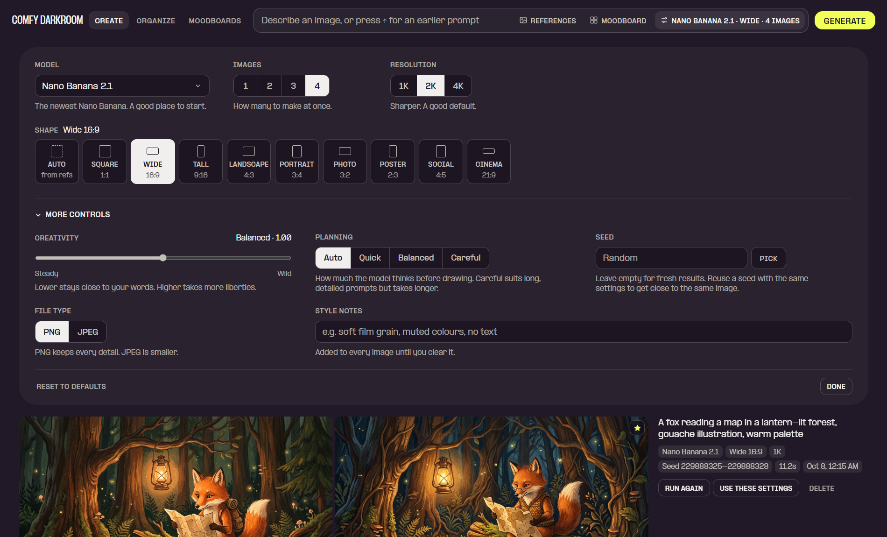
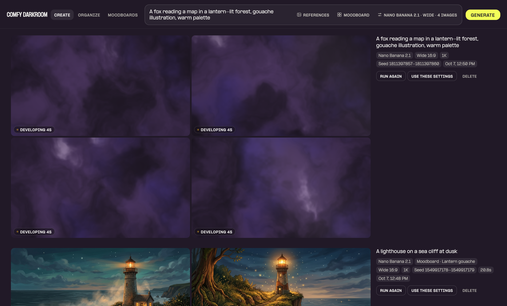
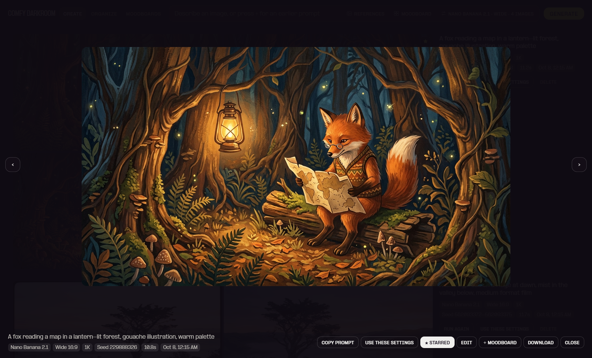
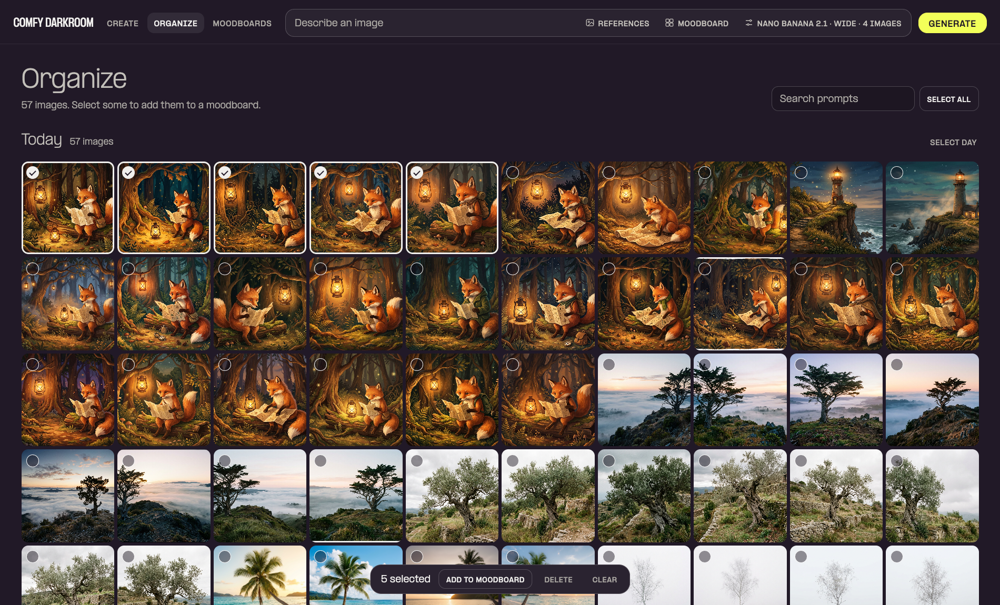
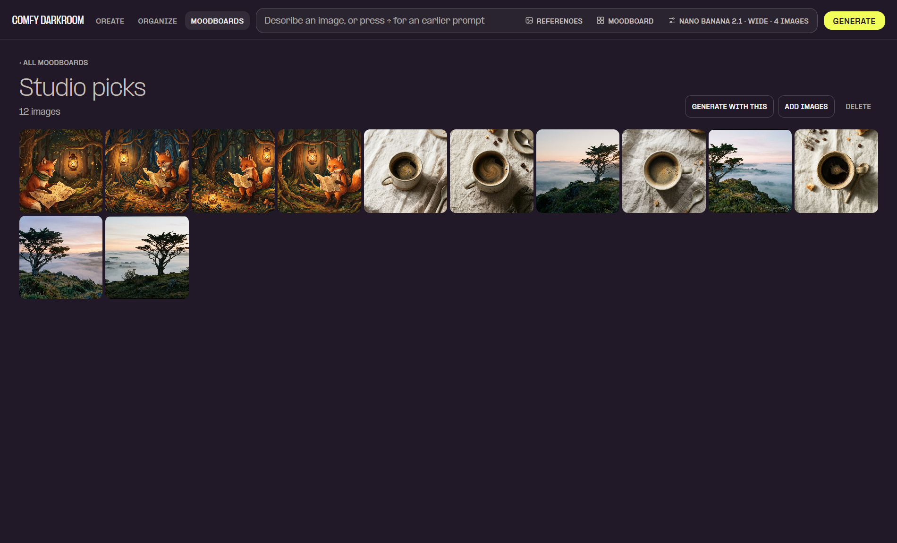
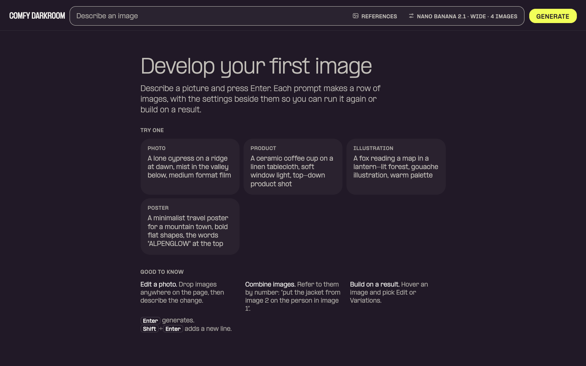

# Comfy Darkroom

A local image playground for the Nano Banana models on [Comfy Router](https://docs.comfy.org). Describe an image, make up to four at once, and watch each set land as a row in a growing feed.



- **Models:** Nano Banana 2.1 (default), Nano Banana 2, Nano Banana Pro, Nano Banana 2 Lite and Nano Banana, each with a one-line note on when to use it.
- **Images:** make 1 to 4 per prompt, each with its own seed. Up to 8 images develop at once; the rest wait their turn, so you can queue several prompts without flooding Router. A reload picks up images still in progress.
- **Cancel:** stop one image or a whole row. One still waiting in line is dropped before it costs anything.
- **References:** add images by button, drag and drop, or paste. They are numbered, so a prompt can say "the jacket from image 2". Any result can become a reference with **Edit**, or seed a new set with **Variations**.
- **Plain-language controls:** Shape (Square, Wide, Tall, Poster…), Resolution, and under *More controls* Creativity, Planning, Seed, File type and Style notes. Each has a short hint.
- **Feed:** one row per prompt, with its settings beside the images (tall shapes like 9:16 sit four across), plus **Run again**, **Use these settings** and **Delete**. Failed images explain what went wrong and offer **Try again**. Rate limits and dropped connections are retried once on their own.
- **Viewer:** click an image to see it large with its model, shape, resolution, seed and time, plus **Copy prompt**, **Use these settings**, **Star**, **Edit**, **+ Moodboard** and **Download**. Downloads are named from the prompt and seed, like `fox-reading-a-map_s1234.png`.
- **Stars:** star the keepers. Delete skips starred images, and Organize can show only them.
- **Undo:** deleting images or a row shows **Undo** for a few seconds instead of asking first.
- **Prompt history:** press ↑ and ↓ in an empty prompt to bring back earlier prompts.
- **While you wait:** the tab title counts images in progress, and when a row finishes in a background tab you get a notification.
- **Organize:** every image you've made in one grid, with tokens used today and in total. Search by prompt, filter to starred, select with a click (Shift-click for a range), then add the selection to a moodboard, star it or delete it.
- **Moodboards:** collect images that share a feel, from Organize, from any result with **+ Moodboard**, or by dropping in your own. Pick a moodboard next to the prompt and new images follow its style.









Everything runs on your machine. No dependencies beyond Python 3.

## Setup

1. Get a Comfy API key at <https://platform.comfy.org/profile/api-keys>. Calls are billed to that account's credits.
2. Add it to a `.env` file:
   ```sh
   cp .env.example .env
   # then edit .env: COMFY_API_KEY=your-key
   ```
   Or export `COMFY_API_KEY` in your shell instead.
3. Start the server:
   ```sh
   python3 server.py          # or: python3 server.py 9000
   ```
4. Open <http://127.0.0.1:8765>.

## How it works

`server.py` is a small standard-library server bound to `127.0.0.1`. It serves `index.html` and forwards each image to `https://api.comfy.org/v2/models/<model>`. Your key stays on the server and never reaches the browser.

Each image is a task. The page hands tasks to the server and polls `/api/tasks` for progress. Eight worker threads make the Router calls, so no more than 8 images are in flight however many prompts, tabs or reloads ask, and the rest wait in line in the order they came. Change `MAX_ACTIVE` in `server.py` if your account allows more. A 429, 5xx or dropped connection is retried once after a short wait. Finished tasks are kept for 15 minutes so a reloaded page can collect them, and a server restart forgets them.

Each image is saved to `outputs/` with a `.json` file holding the prompt, settings, star and Router stats (time, token usage, finish reason). The feed rebuilds from that folder on reload. Deleting in the app moves files to `outputs/.trash/`, which is emptied of anything older than a day. Delete files in `outputs/` yourself to clear them for good.

The thinking previews the model streams back are dropped. Only the final image is kept.

### Moodboards

The app only ever shows the moodboard you picked. Behind that:

1. The page packs the board's images into grid sheets of up to 6, spread evenly over the fewest sheets (30 images make 5 sheets of 6, 25 make 5 of 5, 7 make 4 + 3). A board with more than 36 images is sampled evenly down to 36, so at most 6 sheets go out.
2. The sheets are drawn on a canvas in the browser (512px cells, cover-cropped) and cached until the board changes.
3. They are sent after any references you added yourself. The server puts a short note in front of your prompt telling the model to read the sheets as art direction (palette, lighting, texture, mood), not to copy their subjects, and to return one image rather than a grid.

The note is not saved with the image, so a row shows your prompt as you wrote it. Boards are stored in `moodboards/boards.json`; images you upload to a board go in `moodboards/assets/`.

## What the controls send

The labels are friendlier than the API. This is what each one sets on the Router request:

| In Darkroom | Router field |
|---|---|
| Images | number of requests, queued together (seed + 0, + 1, …) |
| Shape | `imageConfig.aspectRatio` (Auto leaves it unset) |
| Resolution | `imageConfig.imageSize` |
| Creativity | `temperature` (Steady 0 to Wild 2, default 1) |
| Planning: Auto, Quick, Balanced, Careful | `thinkingConfig.thinkingLevel`: unset, `MINIMAL`, `MEDIUM`, `HIGH` |
| Seed | `seed` |
| File type | `imageConfig.imageOutputOptions.mimeType` |
| Style notes | `systemInstruction` |

## Updating the screenshots

The images in `docs/` come from `scripts/screenshots.mjs`. Retake them with any UI change. The moodboard shot uses your first board with images, or a demo board built from recent images that is never saved.

```sh
npm i --no-save puppeteer-core     # once
python3 server.py &                # needs a working key
node scripts/screenshots.mjs       # makes three 4-image runs at 1K (12 images)
```

Set `CHROME` if Chrome isn't in the usual place for your OS. Stars the script adds for the shots are removed again at the end.

## Notes

- Planning level `LOW` is not offered: Router rejects it for Nano Banana 2.1.
- Nano Banana (2.5 Flash Image) has one resolution, so Resolution is turned off for it.
- Cancelling an image that's already developing stops Darkroom waiting for it, but Router still finishes and bills it. It just isn't saved.
- Token counts are what Router reports for the images on disk. Failed and cancelled images aren't counted.
- `.env`, `outputs/` and `moodboards/` are gitignored.


